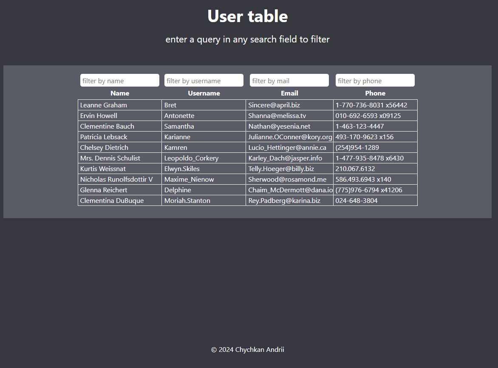
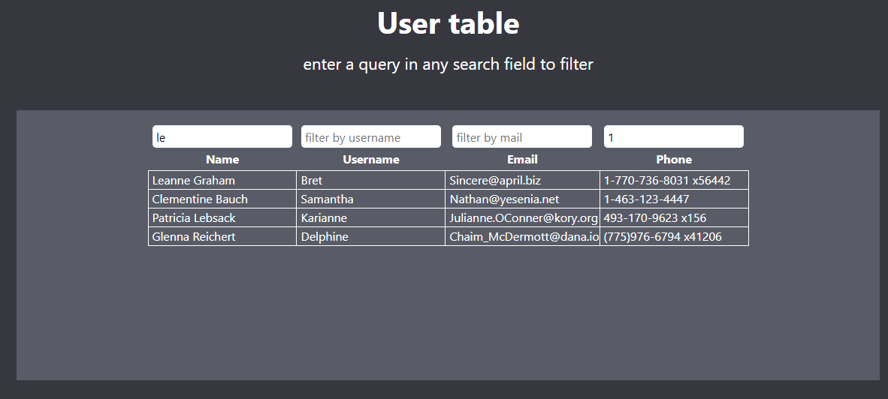
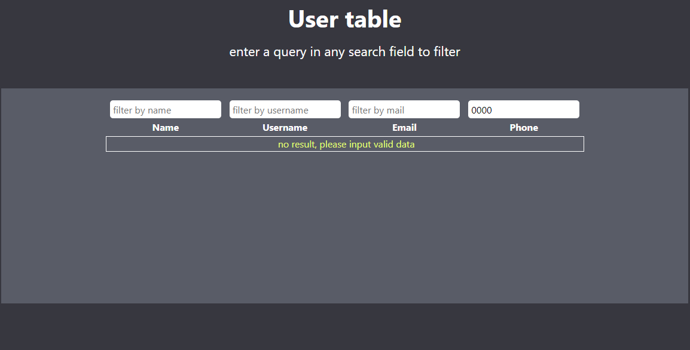
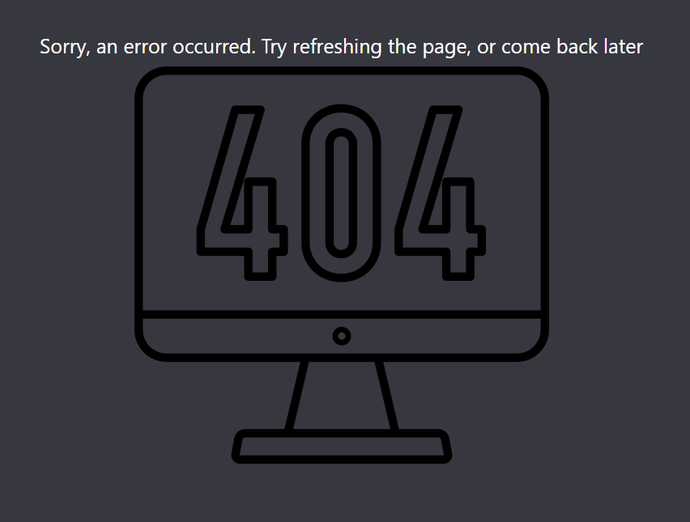

## SMART buisness test application

_Додаток для перегляду та фільтрування даних в таблиці користувачів_

#### Отримання повного списку користувачів

при воході на сайт ви можете побачити повну таблицю користувачів, з полями для вводу фільтрів. Можна фільтрувати по всім стовпчикам - ім'я, ім'я користувача, електонна пошта та телефон.

#### Відображення лоадера при завантаженні даних

Хоча данних не так і багато, про те при повільному інтернет з'єднанні з'являється спінер (лоадер), який показує активне завантаження даних. На даному етапі це не відіграє вликої ролі, про те корисно при розширенні проєкту.

#### Отримання відфільтрованого списку користувачів

при введенні запитів у форми для фільтрацію, виконується динамічна фільтрація користувачів. Кожен окремий фільтр пов'язаний з іншими, що дозволяє виконувати пошук одразу по декільком запитам. Пошук працює по всій довжині табличних даних, не тільки по першим символам.

#### Введення невалідних данних

якщо по пошуковому запиту в фільтрах нічого не знайдено - отримаємо повідомлення про відсутність даних, та прохання ввести валідні дані

#### Результат помилки

якщо при завантаженні даних трапляється помилка - відображується компонент помилки з картинкою, описується помилка, та з'являється прохання перезавантажити сторінку. При цьому зникають надписи хедеру з назвою таблиці, та проханням ввести данні для фільтрації

### Розробка

#### Збірка проєкту

проєкт зібраний за доомогою Vite, деплой виконується на Netlify. Зазвичай використовую GitHub LIvePage, або GitHub Actions але цього разу вирішив по іншому - та не розчарувався. З гітхабом завжди виникали проблеми деплою. А з Netlify - все просто, запушивши зміни в головну гілку, навіть без збирання проєкту, отримав повідомлення про успішний деплой на протязі 20-ти секунд, та все готово, можна переглядати.

#### Design Patterns

Було використано Layout Components Pattern - дуже зручний паттерн для відображення компонентів всередині layout.

#### TypeScript

Додаток використовую типізацію TypeScript, що допомогає уникнути помилок ще під час розробки. Також типізація буде корисна при маштабуванні проєкту, та залученні нових розробників.

#### Керування станом

В даному проєкті було проблематично застосовувати Redux, так як він невеликого розміру 😊. Без керування станом MVP був готовий доволі швидко, після додавання Redux все заягнулось декілька годин. Так як зі звязкою Redux Toolkit та TypeScript працюю вперше. Хоча керування станом на даному етапі беззмістовне, про те воно матиме сенс при розширенні проєкту

#### Запити

Для виконання запитів із сервера використовується бібліотека Axios з типовим асинхронним запитом та обробкою помилок.

#### Стилізація

Для стилізації використано Styled Component, можливо завелике рішеня для невеликого проєкту, про те це додає зручності, та знайоме майже кожному розробнику
